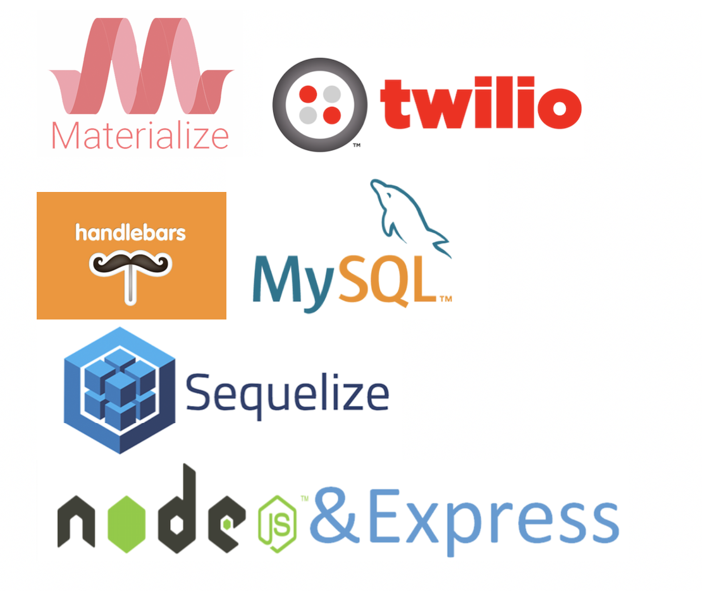
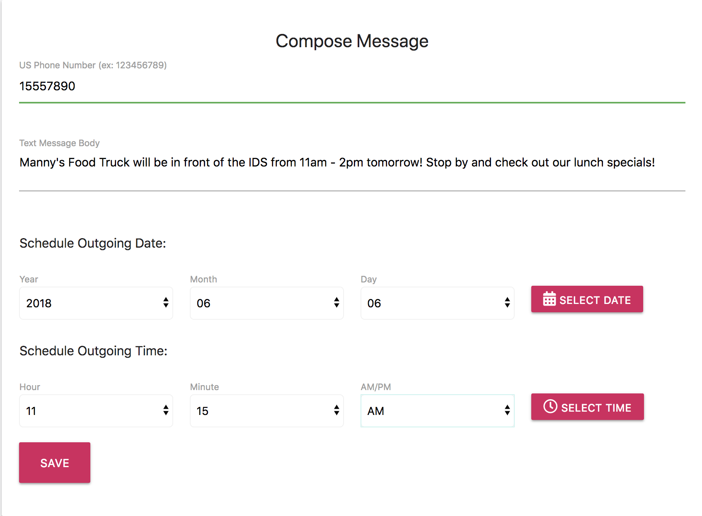
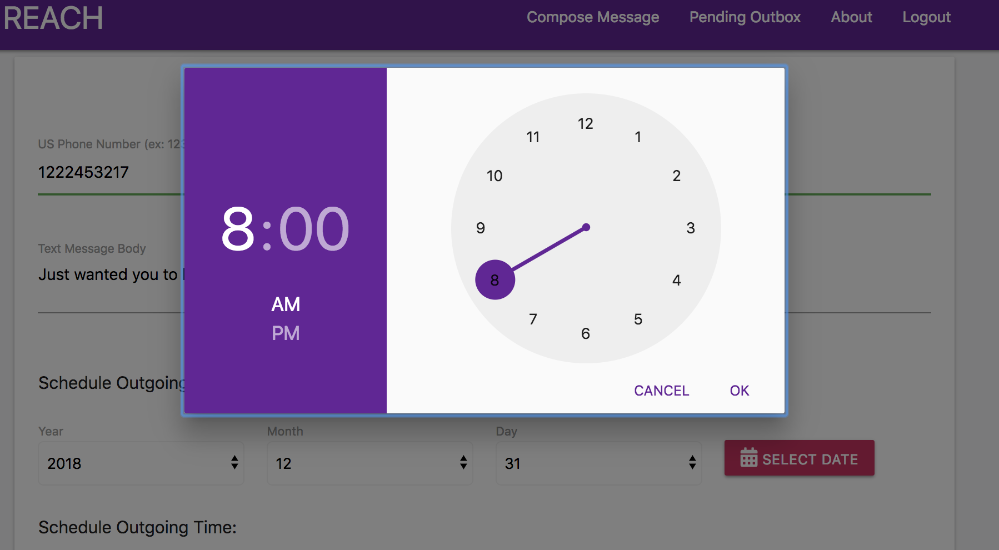
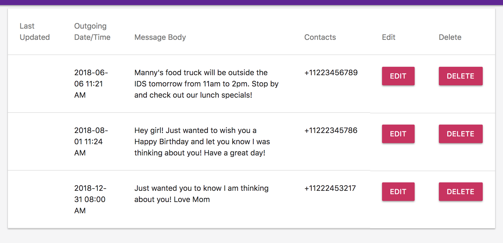
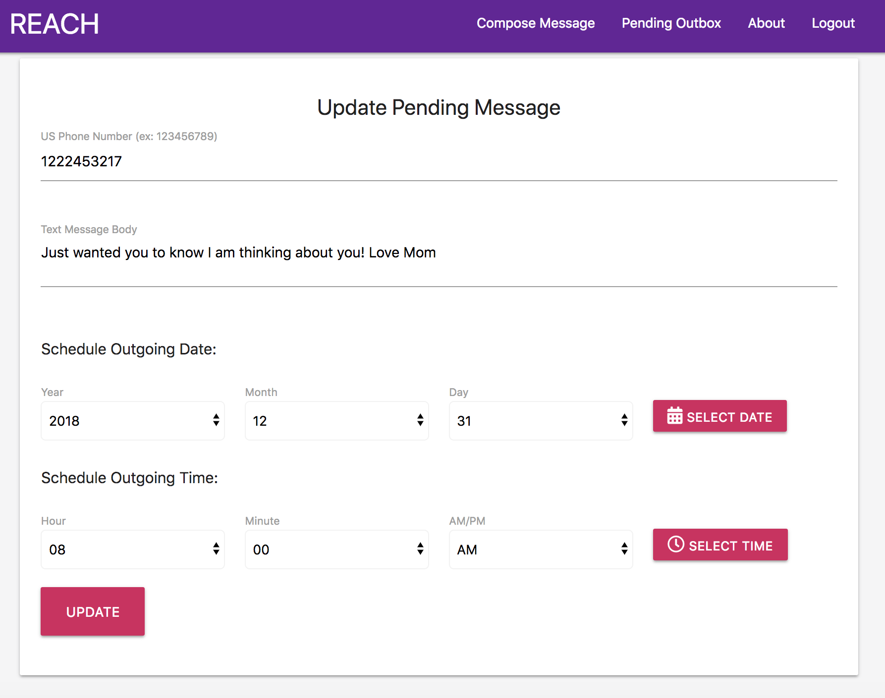

## Hosted on Heroku **Note** This app needs to be reactivated in order to perform the actions correctly. If you wish to see it operate, please contact the owner of the Repo.<a href="https://arcane-bastion-12475.herokuapp.com/">Here

<br>

## Created during week 16 of Trilogy Bootcamp. REACH is an app allowing the user to send a text at a pre-determined time and date of their choice. 

 > Made by busy people, for busy people. REACH's clean interface and self-explanatory fields allow entrepenuers and spontaneous customers alike to make the most out of the time we spend on our cell phones
## <a href="https://app.xtensio.com/folio/s5ls38nj">UX Persona</a>

## Features: 
1. Validation in the phone number, message, and date/time fields to ensure foolproof texting. 
2. The ability to view your pending outbox and delete or edit messages at will before sending. 
3. Send mass-texts to unique numbers, and set the "send date" to any time within the calendar year {mass-text feature pending}

## Reach is a full-stack app incorporating:



## SCREENSHOTS
<br>

<br>
Choose a date and time


<br>
View your pending outbox

<br>
Edit pending texts



## Authors
* ```Brandon Vreeman```
* ```Maggie Rassett```
* ```Majid Jamaleldine```
* ```Saundra Peterson```
* ```Thom Romano``` 
<br>

```Get out there and start texting!``` :iphone:


