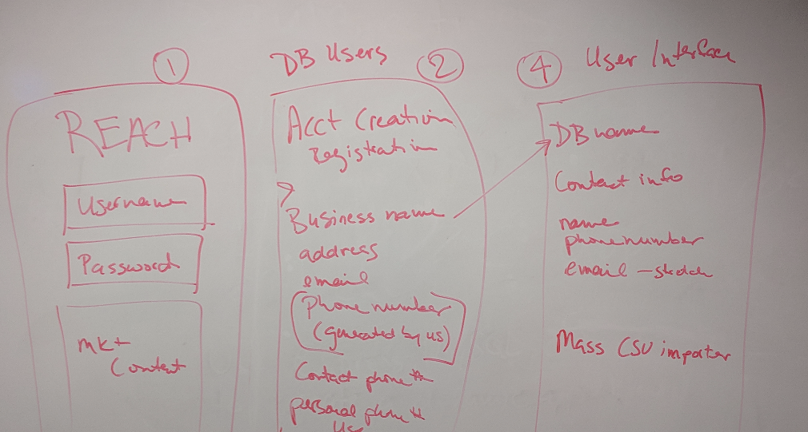
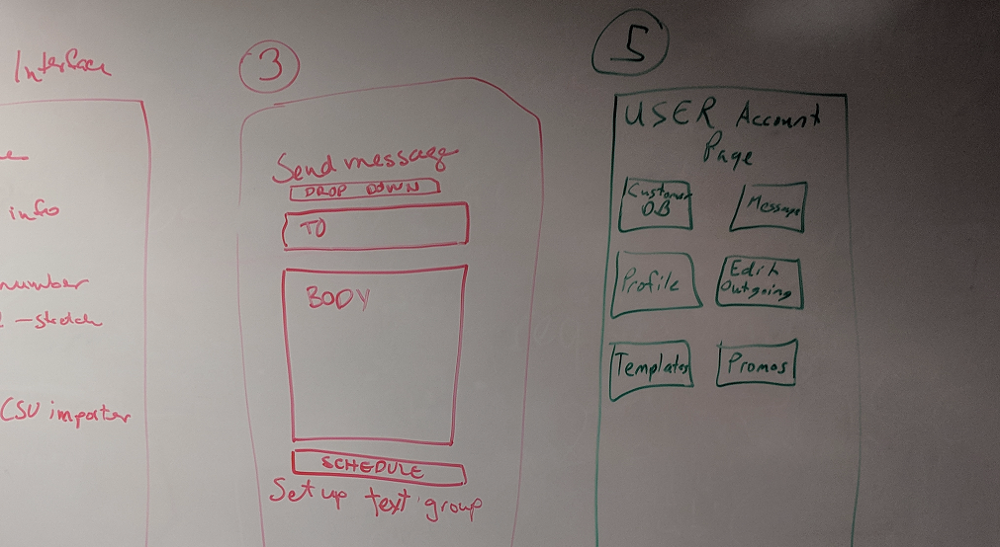

# Group 2 Project

### App Title: 
### Reach

### Description of Project: 
Messaging service that allows personal users, small and mid-size businesses to text information to users based on their specifications.

### Link: <a href="https://github.com/bvreeman/group-2-project/projects">Project Page</a>
### Link: <a href="https://app.xtensio.com/folio/s5ls38nj">Persona</a>

### Features:
Each company/user can send emails to an individual or a group.
Personalized database of contacts
Add and delete users from database per company/individual
Scheduling of text messages date/time
Delete scheduled messages before scheduled time.
Stretch: Templates for users
    Apointment reminders
    Weekly updates / short info blast / coupon code
    Personal reminder
    Custom template defined by customer

### User Stories:

Manny's Manicotti Food Truck: Small business user who needs to be able to notify customers of weekly locations/events where his truck will be parked. Ability to send coupon codes to increase business during slow periods.

Personal user: Busy individual that wants to schedule text messages/reminders to family members to attend events or pick up groceries/dry cleaning, etc. Ability to schedule "date escape" text to themselves.

Small Business owner such as doctor, hairdresser, etc. to remind customers of scheduled appointments. 

## Tiered Stages:

### Tier 1:
Send text message to self or others

### Fields:
* Phone # of sender
* Phone # of recipient
* Date to send message
* Time to send message
* Message

### Functionality:
* Add to database
* Schedule/Send message
* Delete message	

### Tier 2:
* Login process
* Registration for company or individual

### Fields:
* Business Name
* Address
* Phone number (company #)
* Twillio Number (stretch)
* Email address

### Tier 3:
* Templates
* Groups
* Unsubscribe text messages

## Wireframes

